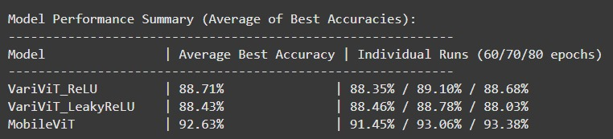
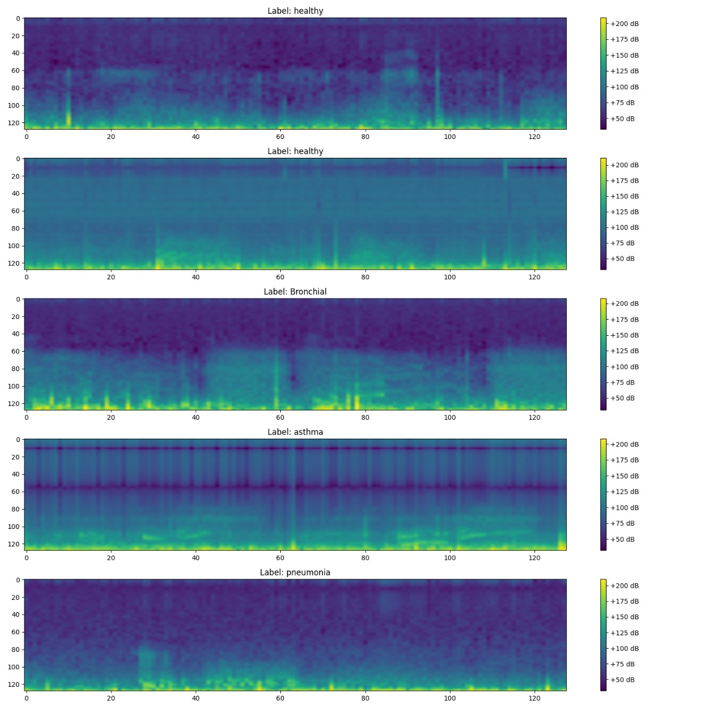

🌐 Website Deployment
The application is deployed and accessible at:
🔗 https://lsd-47kq.onrender.com

⚠️ Please note: The website is hosted on Render's free tier, so it may take up to 1 minute to start on the first visit due to cold start delays.

📊 Comparison of Vision Transformer Models
This plot compares the performance of different Vision Transformer (ViT) architectures used for lung sound classification.

📈 Cochleogram Visualization
Below is a sample cochleogram image extracted during feature engineering for respiratory sound classification:

